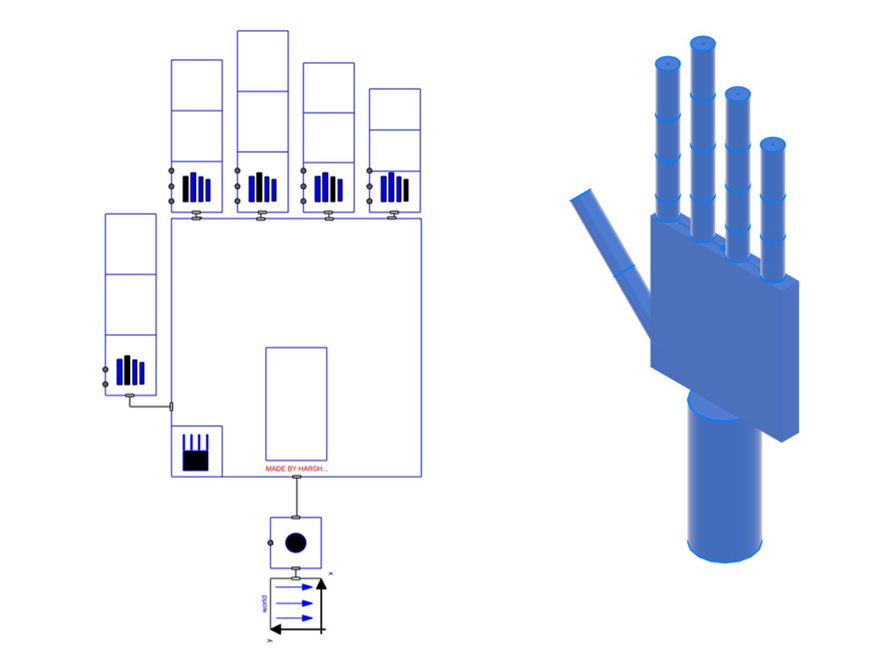
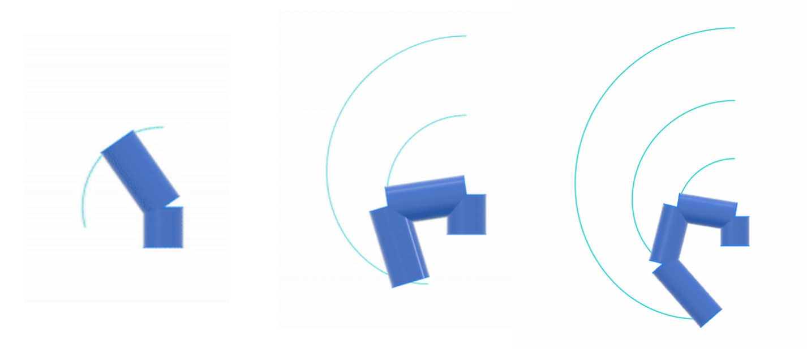
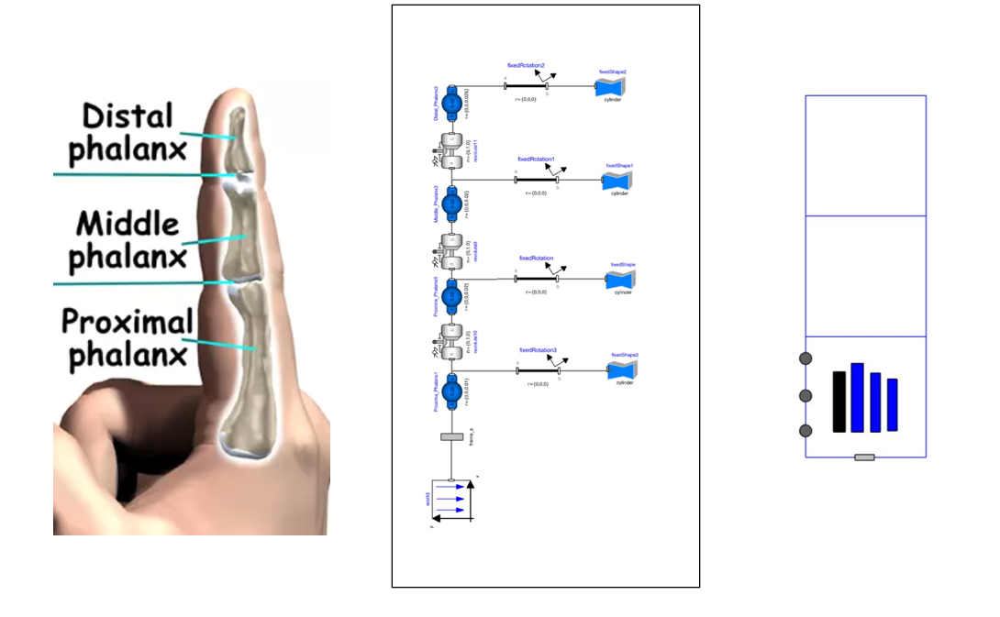
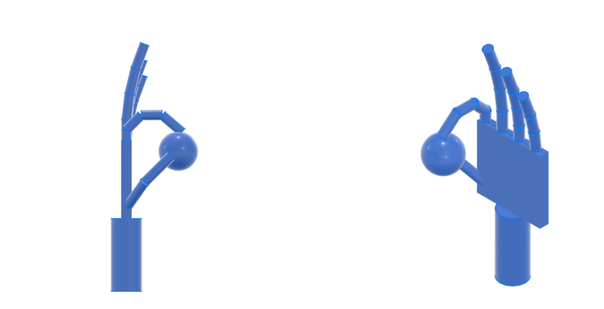
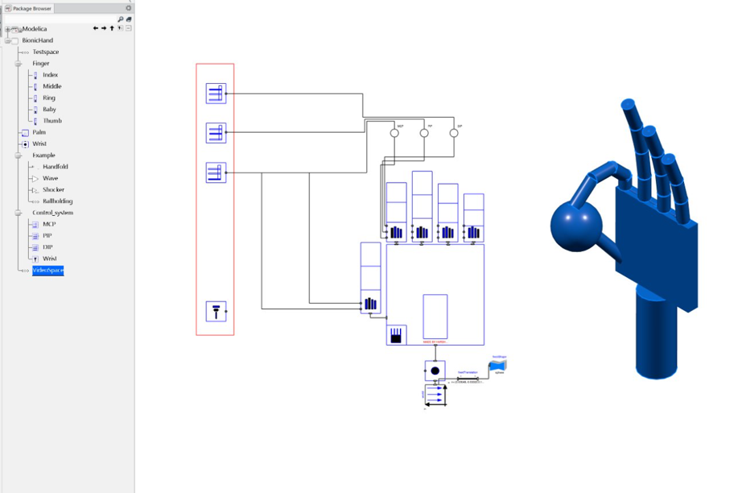

# Bionic Hand Library: Multiphysics Modeling in Modelica
## Overview
This repository provides a Modelica-based library for simulating bionic hand components.
It was developed as part of the IME878 MS Directed Project at Wichita State University under the guidance of Dr. Enkhsaikhan "EK" Boldsaikhan.

The library enables multi-domain modeling (mechanical, electrical, and thermal) of the bionic hand, including anatomical replication of fingers, thumb, and palm. Control logic, forward/inverse kinematics, and simulation of gestures (e.g., pinch grip, shocker sign) are included to demonstrate virtual prototyping of assistive robotic systems.
## Architecture

## Scope & Goals
### Scope
- Modular Modelica library for bionic hand components.
- Multiphysics digital twin of a hand for research, simulation, and virtual prototyping.
- Simulation of individual finger, thumb, and palm joints with actuation and kinematics.
### Goals
- Model all five fingers and thumb using parameterized revolute joints.
- Implement control systems for actuation and gesture execution.
- Enable forward and inverse kinematics for precise motion planning.
- Support electro-mechanical and thermal domains.
- Provide proof-of-concept simulations for real-world applications in prosthetics and robotics.

## Features
- Component Library: Reusable modules for joints, phalanges, actuators, and palm assembly.
- Gesture Simulation: Demonstrates motions such as pinch grip and shocker sign.
- Control System: Implements position tracking, motion actuation, and stability control.
- Kinematics: Forward and inverse kinematics support for finger trajectories.
## Finger Kinematics

## Methodology
1. Component Modeling: Body shapes, revolute joints, and phalanges.
2. Finger Modeling: Parameterized models for single and multiple fingers.
   ## Finger Model

4. Thumb and Palm: Independent thumb modeling and palm integration.
5. Control System: Feedback-based actuation of finger joints.
6. Kinematics: Forward and inverse mapping between fingertip positions and joint angles.

## Getting Started
### Requirements
- Dymola or another Modelica-compliant tool.
- Standard Modelica libraries.

## Running Simulations
## Pinch Grip Simulation

1. Open the BionicHandLibrary package in your Modelica tool.
2. 2Navigate to the Examples package.
3. Load the desired model (e.g., PinchGrip.mo, ShockerSign.mo).
4. Set simulation time (e.g., 10s) and run the model.
5. Plot joint angles, forces, or electrical data from results.

## Workspace

